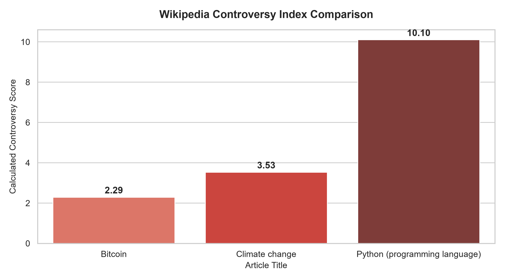

# 📊 Wikipedia Article Controversy Index Analysis

A lightweight data analysis project exploring MediaWiki API revision histories to quantify and compare debate intensity across Wikipedia topics.

## 💡 The Core Metric
The **Controversy Index** measures edit volatility based on two key metrics from the last 500 page revisions:

$$\text{Controversy Score} = \left( \frac{\text{Reverts}}{\text{Total Edits}} \right) \times \left( \frac{\text{Unique Editors}}{\text{Total Edits}} \right) \times 100$$

- **Revert Ratio:** Captures how frequently edits are undone due to vandalism or edit wars.
- **Editor Diversity:** High unique user ratios indicate widespread community debate vs. a single maintainer updating content.

---

## 📈 Key Findings

1. **High Volatility:** Topics with active public debate (*Bitcoin*, *Climate Change*) exhibit higher revert rates and broader editor participation.
2. **Technical Stability:** Documentation-style articles (*Python programming language*) show low revert rates and high stability.

---

## 🛠️ Stack & Setup

- **Language:** Python 3
- **Libraries:** Pandas, Matplotlib, Seaborn, Requests
- **Data Source:** [Wikipedia Action API](https://www.mediawiki.org/wiki/API:Main_page)
